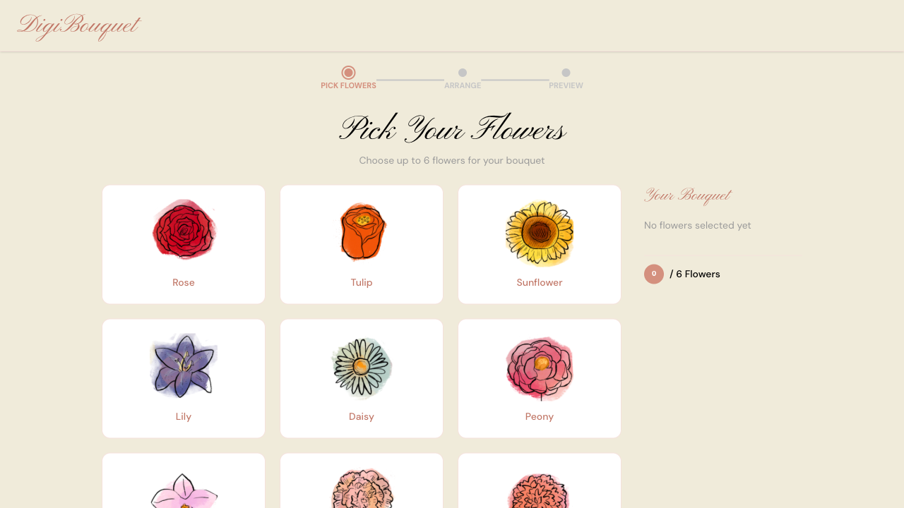
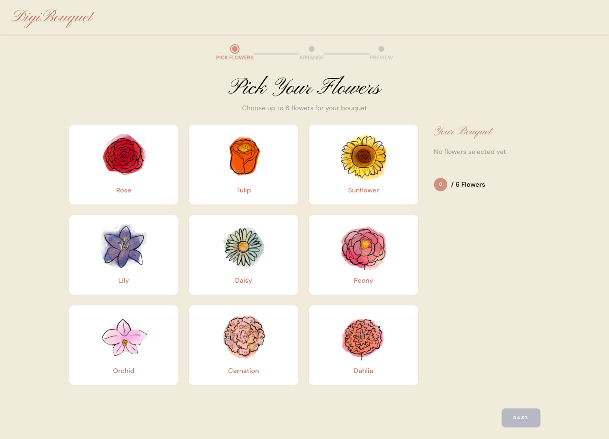
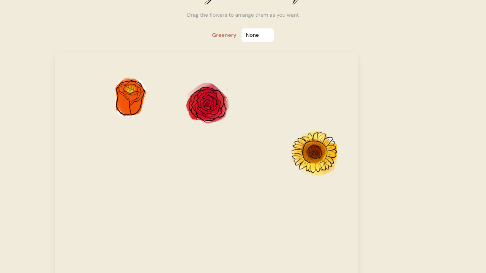
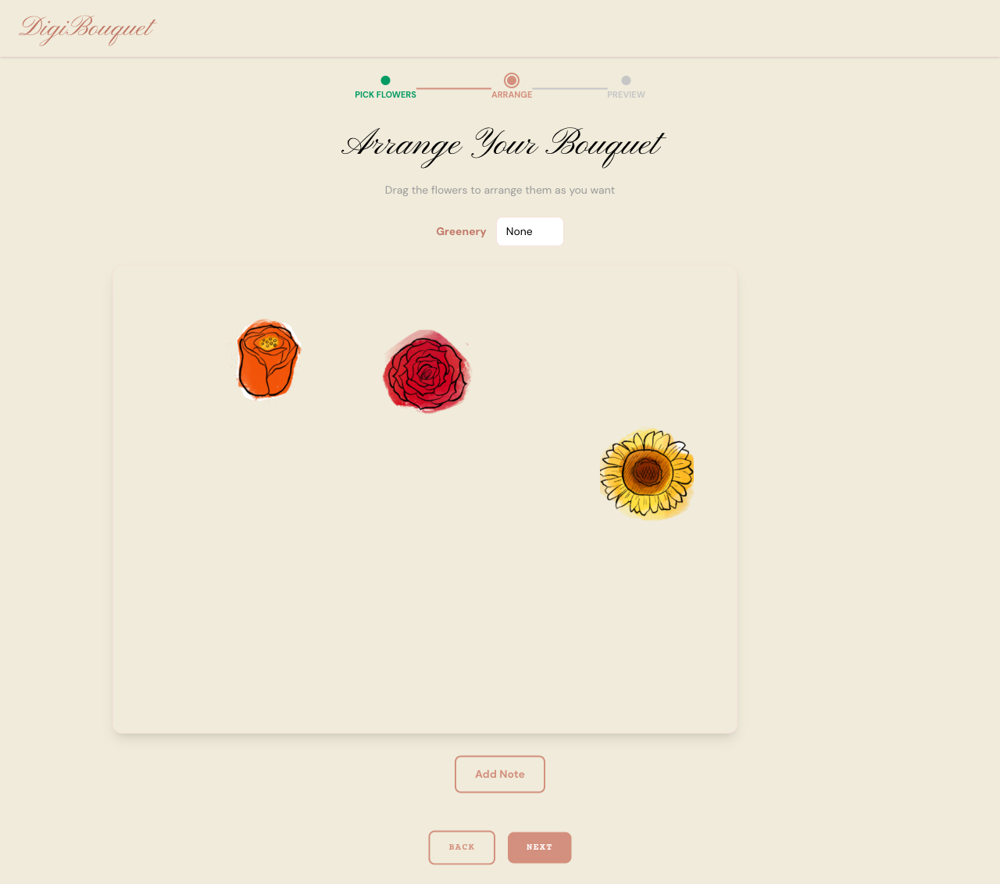
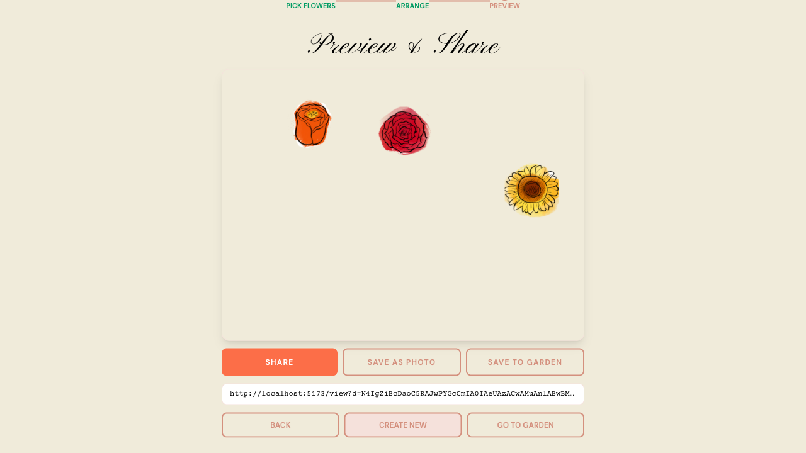
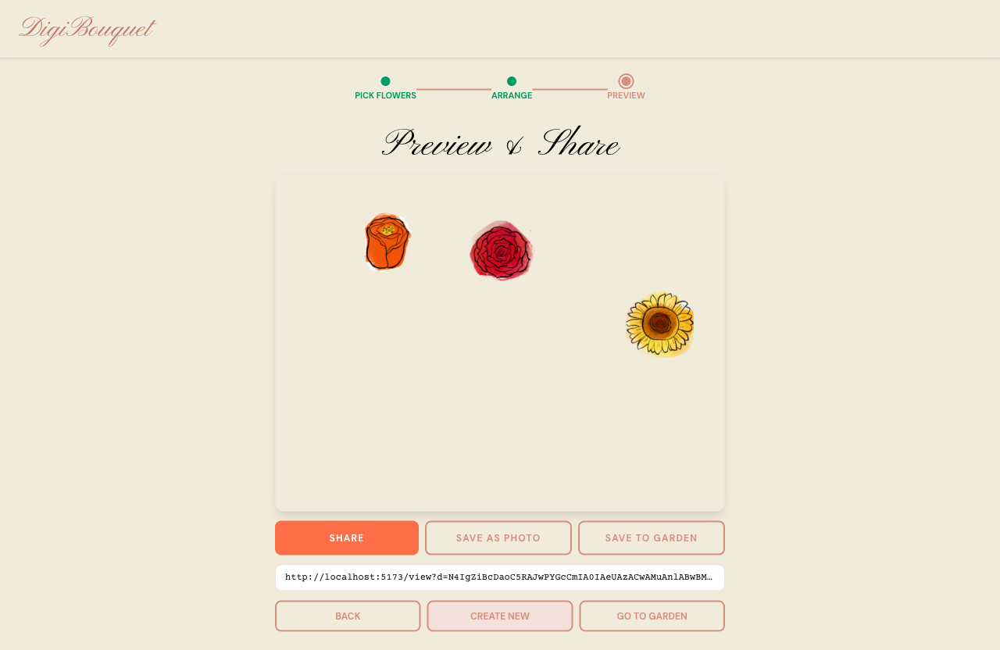

# Issue: Scroll Overflow and Button Hierarchy on 1280x720 Viewport

**Status**: investigating
**Severity**: high
**Reported**: 2026-02-11
**Component(s)**: Layout (builder steps, navigation), UI hierarchy (step 3 buttons)

---

## Problem

Playwright testing at 1280x720 viewport reveals significant scroll overflow on three builder pages (Steps 1, 2, 3) where critical UI elements (flower tiles, control buttons, navigation) are cut off below the fold. Additionally, Step 3 suffers from poor button hierarchy — six buttons with nearly identical visual weight create confusion about primary vs. secondary vs. destructive actions.

### Expected Behavior
- All critical UI elements fit within the 1280x720 viewport without scrolling
- Button hierarchy is visually clear (primary > secondary > tertiary)
- Navigation and action buttons are always accessible

### Actual Behavior
- Step 1: Bottom flower row + NEXT button hidden (204px overflow)
- Step 2: Add Note button + BACK/NEXT navigation hidden (412px overflow)
- Step 3: BACK/CREATE NEW/GO TO GARDEN buttons partially hidden (112px overflow)
- Step 3: SHARE, SAVE AS PHOTO, SAVE TO GARDEN, BACK, CREATE NEW, GO TO GARDEN all appear identical

---

## Overflow Measurements (1280x720 Viewport)

| Page | scrollHeight | clientHeight | overflow (px) | Status |
|------|-------------|-------------|---------------|--------|
| Home (`/`) | 720 | 720 | 0 | ✓ OK |
| Step 1 (`/build/pick`) | 924 | 720 | **204** | ⚠ SCROLL |
| Step 2 (`/build/arrange`) | 1132 | 720 | **412** | ⚠ SCROLL |
| Step 3 (`/build/preview`) | 832 | 720 | **112** | ⚠ SCROLL |
| Garden (`/garden`) | 720 | 720 | 0 | ✓ OK |
| Viewer (`/view?d=...`) | 720 | 720 | 0 | ✓ OK |

---

## Issue 1: Step 1 — Flower Grid Overflows (204px)

**Priority**: High
**Root Cause**: The 3x3 flower grid combines large tile images (`w-24 h-24`), padding (`p-5`), and gaps (`gap-5`). With the navbar (~60px), step indicator (~50px), title (~80px), and subtitle, the total content height exceeds 924px.

**What's Cut Off**: The entire bottom row (Orchid, Carnation, Dahlia) + the NEXT button are completely hidden.

### Screenshots

**Viewport View (cut off bottom is invisible):**


**Full-Page View (shows hidden content below fold):**


### ASCII Annotation (Viewport)

```
┌────────────────────────────────────────────────────┐
│ DigiBouquet                        MY GARDEN       │ ← navbar: 60px
├────────────────────────────────────────────────────┤
│      ● PICK ────── ○ ARRANGE ────── ○ PREVIEW      │ ← step indicator: 50px
│                                                    │
│                Pick Your Flowers                   │ ← title: 80px
│          Choose up to 6 for your bouquet           │
│                                                    │
│    ┌─────┐ ┌─────┐ ┌─────┐   Your Bouquet         │
│    │  🌹 │ │  🌷 │ │  🌻 │   Rose      - 1 +      │ ← tiles 1-3: ~100px
│    │Rose │ │Tulip│ │Sun. │   Tulip     - 1 +      │
│    └─────┘ └─────┘ └─────┘                        │
│    ┌─────┐ ┌─────┐ ┌─────┐   Lily       - 0 +     │ ← tiles 4-6: ~100px
│    │  🌺 │ │  🌼 │ │  🌸 │   Daisy     - 0 +      │
│    │Lily │ │Daisy│ │Peony│                        │
│    └─────┘ └─────┘ └─────┘                        │
│                                                    │
│ ╌╌╌╌╌╌╌╌╌╌╌╌╌╌╌╌╌╌╌╌╌╌╌╌╌╌╌╌╌╌╌╌╌╌╌╌╌╌╌╌╌╌╌ ┐ ← overflow begins here
│ ║                                              ║ │   (scrollHeight > 720)
│ ║ ┌─────┐ ┌─────┐ ┌─────┐                       ║ │
│ ║ │  🌺 │ │  💐 │ │  🌸 │     (HIDDEN)       ║ │ ← tiles 7-9 cut off
│ ║ │Orchi│ │Carntn│ │Dahia│                       ║ │   204px beyond fold
│ ║ └─────┘ └─────┘ └─────┘                       ║ │
│ ║                                              ║ │
│ ║                  [NEXT ▶]    (HIDDEN)         ║ │ ← nav button cut off
│ ║                                              ║ │
│ ╌╌╌╌╌╌╌╌╌╌╌╌╌╌╌╌╌╌╌╌╌╌╌╌╌╌╌╌╌╌╌╌╌╌╌╌╌╌╌╌╌╌╌ ┘ │
│                                                    │
│ ← scrollbar thumb appears here (user must scroll) │
└────────────────────────────────────────────────────┘
```

### Related Files
- `src/features/builder/Step1.tsx` — Container layout, grid margin/padding
- `src/features/builder/FlowerGrid.tsx` — 3x3 grid, `gap-5`, `grid-cols-3`
- `src/features/builder/FlowerTile.tsx` — Tile sizing (`w-24 h-24`), padding (`p-5`)
- `src/features/builder/Cart.tsx` — Sidebar width/height affecting grid width

### Proposed Solution

Reduce vertical footprint by:
1. **Tile sizing**: `w-24 h-24` → `w-16 h-16` (saves ~40px per row, 2 rows = 80px)
2. **Tile padding**: `p-5` → `p-3` (saves ~16px per tile)
3. **Grid gap**: `gap-5` → `gap-3` (saves ~16px between columns/rows, 2 gaps = 32px)
4. **Title**: Reduce font size or line-height (saves ~20px)
5. **Cart**: Change from side-by-side to floating overlay or collapsible panel on tight screens (saves 150px+ width, allowing grid to be centered)

**Estimated savings**: 120–200px total, fitting all content within 720px.

---

## Issue 2: Step 2 — Canvas + Controls Overflow (412px)

**Priority**: Critical
**Root Cause**: BouquetCanvas is fixed at 800x600 (4:3 aspect ratio) with only **width-based scaling**, not height-based. At 1280x720, the canvas takes the full 600px of viewport height. With navbar (~60px), step indicator (~40px), title (~80px), instruction text (~40px), greenery dropdown (~40px), Add Note button (~40px), and BACK/NEXT buttons (~60px), the total reaches ~1132px.

**What's Cut Off**: The "Add Note" button and both BACK/NEXT navigation buttons are completely below the fold (412px overflow).

### Screenshots

**Viewport View (canvas fills viewport, buttons invisible):**


**Full-Page View (shows buttons below canvas):**


### ASCII Annotation (Viewport)

```
┌────────────────────────────────────────────────────┐
│ DigiBouquet                        MY GARDEN       │ ← navbar: 60px
├────────────────────────────────────────────────────┤
│    ● PICK ────── ◉ ARRANGE ────── ○ PREVIEW        │ ← indicator: 40px
│                                                    │
│              Arrange Your Bouquet                  │ ← title: 36px
│     Drag flowers to arrange them                   │ ← instruction: 40px
│                                                    │
│      Greenery: [None ▼]                            │ ← dropdown: 40px
│                                                    │ ← spacing
│  ┌──────────────────────────────────────────────┐  │
│  │                                              │  │
│  │         🌹                🌷                │  │ Canvas at 600px height
│  │                                              │  │ fills from ~250px to 850px
│  │               🌻                             │  │
│  │                                              │  │
│  └──────────────────────────────────────────────┘  │
│                                                    │
│ ╌╌╌╌╌╌╌╌╌╌╌╌╌╌╌╌╌╌╌╌╌╌╌╌╌╌╌╌╌╌╌╌╌╌╌╌╌╌╌╌╌╌╌ ┐   ← overflow starts here
│ ║                  [Add Note]    (HIDDEN)       ║   │   (scrollHeight > 720)
│ ║                                              ║   │
│ ║            [◀ BACK]      [NEXT ▶]    (HID.) ║   │   ← 412px below fold
│ ║                                              ║   │
│ ╌╌╌╌╌╌╌╌╌╌╌╌╌╌╌╌╌╌╌╌╌╌╌╌╌╌╌╌╌╌╌╌╌╌╌╌╌╌╌╌╌╌╌ ┘   │
│                                                    │
│ ← scrollbar thumb (user must scroll to reach nav)  │
└────────────────────────────────────────────────────┘
```

### Related Files
- `src/features/builder/Step2.tsx` — Container layout, canvas wrapper height
- `src/features/builder/BouquetCanvas.tsx` — Canvas sizing logic (line ~45-50), uses only `wrapperWidth / CANVAS_WIDTH`
- `src/features/builder/GreenerySelector.tsx` — Dropdown height
- `src/features/builder/NoteModal.tsx` — "Add Note" button positioning

### Technical Details: Current Scaling

**Current code** (BouquetCanvas.tsx):
```typescript
const scale = Math.min(1, wrapperWidth / CANVAS_WIDTH);
// Only considers width, ignores height
```

**Problem**: On a 1280-wide screen, `wrapperWidth ≈ 1100`, so `scale = min(1, 1100/800) = 1.0`. Canvas renders at full 800x600, consuming 600px of the 720px viewport.

**Reference**: `src/pages/ViewerPage.tsx` already solves this correctly:
```typescript
const maxHeight = window.innerHeight * 0.55; // 50% of viewport height
const scale = Math.min(1, wrapperWidth / CANVAS_WIDTH, maxHeight / CANVAS_HEIGHT);
// Considers both width AND height
```

### Proposed Solution

1. **Add height-based scaling to BouquetCanvas**:
   ```typescript
   const maxHeight = window.innerHeight * 0.50; // 50vh constraint
   const scale = Math.min(1, wrapperWidth / CANVAS_WIDTH, maxHeight / CANVAS_HEIGHT);
   ```
   This ensures canvas never exceeds 50% of viewport height, leaving 50% for controls.

2. **Merge control rows** (optional but improves UX):
   - Move "Add Note" button inline with Greenery dropdown: `Greenery: [None ▼]  [Add Note]`
   - Saves one row (~40px)

3. **Reduce title/instruction spacing** (optional):
   - Current: title `mb-4` + instruction `mb-6` = 40px
   - Target: title `mb-2` + instruction `mb-4` = 24px
   - Saves ~16px

**Estimated savings**: 150–200px (height-based scaling alone saves ~150px).

---

## Issue 3: Step 3 — Preview Buttons Barely Visible (112px)

**Priority**: High
**Root Cause**: Step 3 uses `maxPreviewHeight = window.innerHeight * 0.6` (60% of viewport height), which at 720px = 432px. The title (~50px), step indicator (~40px), preview canvas at 432px, URL input row (~50px), two button rows (~80px), and gaps (~80px) total ~732px, exceeding 720px by 112px.

**What's Cut Off**: The bottom navigation row (BACK / CREATE NEW / GO TO GARDEN) is partially below the fold.

### Screenshots

**Viewport View (buttons barely visible or cut off):**


**Full-Page View (shows complete button layout below fold):**


### ASCII Annotation (Viewport)

```
┌────────────────────────────────────────────────────┐
│ DigiBouquet                        MY GARDEN       │ ← navbar: 60px
├────────────────────────────────────────────────────┤
│    ● PICK ────── ● ARRANGE ────── ◉ PREVIEW        │ ← indicator: 40px
│                                                    │
│                Preview & Share                     │ ← title: 36px
│                                                    │
│  ┌──────────────────────────────────────────────┐  │
│  │                                              │  │
│  │         🌹                🌷                │  │ Preview at maxHeight
│  │                                              │  │ (60vh = 432px @ 720)
│  │               🌻                             │  │
│  │                                              │  │
│  └──────────────────────────────────────────────┘  │
│                                                    │
│        [SHARE]  [SAVE PHOTO]  [SAVE GARDEN]        │ ← action buttons: 40px
│                                                    │
│    http://localhost:5173/view?d=abc...             │ ← URL input: 40px
│                                                    │
│ ╌╌╌╌╌╌╌╌╌╌╌╌╌╌╌╌╌╌╌╌╌╌╌╌╌╌╌╌╌╌╌╌╌╌╌╌╌╌╌╌╌╌╌ ┐   ← overflow starts
│ ║   [BACK]    [CREATE NEW]     [GO TO GARDEN]     ║   │   (scrollHeight > 720)
│ ║   (PARTIALLY CUT OFF)                          ║   │
│ ║                                                ║   │   ← 112px below fold
│ ╌╌╌╌╌╌╌╌╌╌╌╌╌╌╌╌╌╌╌╌╌╌╌╌╌╌╌╌╌╌╌╌╌╌╌╌╌╌╌╌╌╌╌ ┘   │
│                                                    │
│ ← scrollbar thumb (user must scroll to see BACK)   │
└────────────────────────────────────────────────────┘
```

### Related Files
- `src/features/builder/Step3.tsx` — Preview height calculation, button layout (two rows)
- `src/features/share/ShareActions.tsx` — Action buttons styling/layout
- `src/components/StepNavigation.tsx` — BACK/NEXT buttons (or custom in Step3)

### Proposed Solution

1. **Reduce preview height**:
   ```typescript
   const maxPreviewHeight = window.innerHeight * 0.50; // 50vh instead of 60vh
   ```
   At 720px viewport, this saves 72px.

2. **Collapse button layout** (saves one full row, ~40px):
   - **Row 1**: `[SHARE]  [SAVE PHOTO]  [SAVE GARDEN]` (primary/secondary actions)
   - **Row 2**: `◀ Back      Create New      Go to Garden →` (text links, no boxes)
   - Remove the separate URL input row — integrate into a compact chip or collapsible

3. **Optional: Compact URL display**:
   - Instead of full-width text input, use a copyable link chip or icon-only copy button
   - Saves ~30–40px

**Estimated savings**: 100–150px total.

---

## Issue 4: Step 3 — Button Hierarchy Problem

**Priority**: High
**Root Cause**: Step 3 has six interactive buttons plus a URL input, nearly all with identical visual treatment. The only differentiation is SHARE being coral-filled while everything else is rose-outlined. This creates visual confusion about which action is primary, secondary, or dangerous.

### Current Button Appearance (All nearly identical)

```
Row 1 (Action buttons):
┌────────────────────┐ ┌────────────────────┐ ┌────────────────────┐
│    ✨ SHARE ✨    │ │  SAVE AS PHOTO     │ │  SAVE TO GARDEN    │
└────────────────────┘ └────────────────────┘ └────────────────────┘
  coral fill            rose outline           rose outline
  (only differentiator) (looks secondary)      (looks secondary)

Row 2 (Navigation buttons):
┌────────────────────┐ ┌────────────────────┐ ┌────────────────────┐
│       BACK         │ │   CREATE NEW       │ │   GO TO GARDEN     │
└────────────────────┘ └────────────────────┘ └────────────────────┘
  rose outline          rose outline           rose outline
  (identical to SAVE)   (identical to SAVE)    (identical to SAVE)

URL Input:
┌────────────────────────────────────────────────────────────────────┐
│ http://localhost:5173/view?d=abc123...  (rose outline)             │
└────────────────────────────────────────────────────────────────────┘
```

**Problem**: SAVE AS PHOTO, SAVE TO GARDEN, BACK, CREATE NEW, GO TO GARDEN all look identical. Users don't know which button is "primary" (most important), which is "secondary" (supporting action), or which is "tertiary" (escape/navigation).

### Related Files
- `src/features/builder/Step3.tsx` — Button row layout and styling
- `src/features/share/ShareActions.tsx` — SHARE, SAVE AS PHOTO, SAVE TO GARDEN button styling
- `src/components/StepNavigation.tsx` — BACK button styling

### Proposed Solution

**Clear Three-Level Hierarchy**:

```
PRIMARY (Most Important Action):
┌═══════════════════════════════════┐
║      ✨ SHARE YOUR BOUQUET ✨     ║ ← Big, solid coral, full width
└═══════════════════════════════════┘

SECONDARY (Supporting Actions):
┌──────────────────┐ ┌──────────────────┐
│  Save as Photo   │ │  Save to Garden  │ ← Smaller, outlined rose
└──────────────────┘ └──────────────────┘

LINK/REFERENCE:
    http://localhost:5173/view?d=... [Copy]  ← Compact, icon-based copy

TERTIARY (Navigation):
  ◀ Back        Create New        Go to Garden →  ← Text-only links
```

**Implementation**:
1. **SHARE** (Primary):
   - `bg-rose-600 text-white py-3 px-6 font-bold` (solid fill)
   - Full width or prominent
   - Responsive to loading state (spinner)

2. **SAVE AS PHOTO + SAVE TO GARDEN** (Secondary):
   - `border-2 border-rose-400 text-rose-600 py-2 px-4` (outlined)
   - Side by side, 48% width each with gap
   - Each responsive to loading state

3. **URL Input/Copy** (Reference):
   - Replace full-width input with compact chip: `[http://...] [Copy icon]`
   - Or: Collapsible "Share Link" section that expands on-demand
   - Saves vertical space

4. **BACK / CREATE NEW / GO TO GARDEN** (Tertiary):
   - Text-only links, no border/background
   - Gray color (`text-gray-600`)
   - Hover: underline
   - No visual weight — clearly navigation only
   - Single row, centered, spaced evenly

---

## Steps to Reproduce

### Step 1 Overflow (204px)
1. Open app in Playwright test: `viewport: { width: 1280, height: 720 }`
2. Click "Start Creating"
3. Observe: Bottom row of flowers (Orchid, Carnation, Dahlia) is not visible
4. Scroll down to find NEXT button

### Step 2 Overflow (412px)
1. From Step 1, click NEXT
2. Observe: Canvas fills viewport, "Add Note" button not visible
3. Scroll down to find BACK/NEXT buttons

### Step 3 Overflow (112px)
1. From Step 2, click NEXT
2. Observe: Bottom navigation (BACK / CREATE NEW / GO TO GARDEN) is partially cut off
3. Must scroll to access BACK button

### Step 3 Button Hierarchy
1. From Step 2, click NEXT (Step 3)
2. Observe: All buttons (SHARE, SAVE AS PHOTO, SAVE TO GARDEN, BACK, CREATE NEW, GO TO GARDEN) have nearly identical appearance
3. No visual hierarchy indicates which is primary vs. secondary

---

## Investigation Notes

### Width-Based Scaling Root Cause

**BouquetCanvas.tsx** (approx. line 45–50):
```typescript
// CURRENT (problematic):
const scale = Math.min(1, wrapperWidth / CANVAS_WIDTH);
// Only considers width, ignores viewport height
```

**ViewerPage.tsx** (approx. line 60–65, CORRECT):
```typescript
// CORRECT (already implemented here):
const maxHeight = window.innerHeight * 0.55;
const scale = Math.min(1, wrapperWidth / CANVAS_WIDTH, maxHeight / CANVAS_HEIGHT);
// Considers both dimensions
```

**Action**: Copy the height-based scaling logic from ViewerPage to BouquetCanvas.

### Navbar Height Constant

The navbar is approximately 60px in all pages. Verify:
- `src/components/Layout.tsx` — height of navbar element

### Step Indicator Height

The step indicator (● ○ ○ progress row) is approximately 40–50px. Verify:
- `src/components/StepIndicator.tsx` (if exists) or inline in BuilderPage

### Canvas Fixed Dimensions

Confirmed in CLAUDE.md:
- Canvas: 800x600 (4:3 aspect ratio)
- Step 2 max scale should be: `Math.min(1, wrapperWidth / 800, (viewportHeight * 0.5) / 600)`
- Step 3 max scale should be: `Math.min(1, wrapperWidth / 800, (viewportHeight * 0.5) / 600)`

---

## Proposed Fix Priority

| Issue | Severity | Effort | Impact | Priority |
|-------|----------|--------|--------|----------|
| Step 1: Grid overflow | High | Medium | 200px saved | 1st |
| Step 2: Canvas height scaling | Critical | Low | 150–200px saved | 2nd |
| Step 3: Preview height + layout | High | Medium | 100–150px saved | 3rd |
| Step 3: Button hierarchy | High | Medium | UX clarity | 4th |

---

## Open Questions

1. **Step 1 Cart Layout**: Should the cart move to a floating overlay or collapsible panel on tight screens? Or resize the tiles further?
2. **Step 2 Control Merge**: Should "Add Note" button be inline with Greenery dropdown, or remain on its own row?
3. **Step 3 URL Display**: Should the full-width text input be replaced with a compact copyable chip? Or kept as-is?
4. **Mobile Behavior**: How should these steps behave at even smaller viewports (e.g., 768x1024 tablet, 375x812 mobile)?
5. **Button Styling**: Should secondary buttons (SAVE AS PHOTO, SAVE TO GARDEN) be equal-width columns, or flexible?

---

## Testing Plan

After fixes are implemented:

1. **Visual Regression**: Run Playwright at 1280x720, screenshot each step, compare against current
2. **Scroll Test**: Verify `document.documentElement.scrollHeight <= window.innerHeight` for all pages at 1280x720
3. **Button Interaction**: Verify all buttons are clickable without scrolling
4. **Responsive**: Test at 768, 1024, 1280, 1920 widths to ensure scaling is proportional
5. **Canvas Aspect Ratio**: Verify BouquetCanvas maintains 4:3 ratio after height-based scaling

---

## Related Issues

- None currently documented

## Files to Review

- `src/features/builder/Step1.tsx`
- `src/features/builder/Step2.tsx`
- `src/features/builder/Step3.tsx`
- `src/features/builder/FlowerGrid.tsx`
- `src/features/builder/FlowerTile.tsx`
- `src/features/builder/BouquetCanvas.tsx`
- `src/features/builder/GreenerySelector.tsx`
- `src/features/share/ShareActions.tsx`
- `src/pages/ViewerPage.tsx` (reference for correct height scaling)
- `src/components/Layout.tsx` (navbar height)
